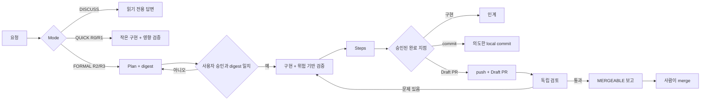

# Gated Development Workflow

Approval-gated Agent Skills for planning, risk-scaled implementation, readable implementation records, intentional commits, Draft PRs, and independent PR validation.

간단한 수정에는 가볍고, 위험한 변경에는 승인과 검증을 강화하는 개인 개발 워크플로입니다. 방향만 받은 에이전트가 프로젝트를 조사해 Plan을 만들고, 사용자가 승인한 범위와 완료 지점 안에서 구현·Steps·commit·Draft PR·검토를 연결합니다.

> 현재 v2는 로컬 구조·script·schema 계약과 Plugin 설치·기본 DISCUSS 직접 호출 smoke를 통과했습니다. Gate 2는 contract와 discovery를 분리해 다시 검증 중이며, 전체 fresh-context pressure scenario, standalone 설치, 실제 GitHub Actions를 통과한 뒤 release-ready로 표시합니다.

## 만든 이유

기존 Agent 개발 흐름을 실제 테스트가 1,000개 이상인 프로젝트에 적용하면서 다음 문제가 반복됐습니다.

- 질문만 했는데 구현 절차가 시작되거나, Plan 승인 범위가 흐려졌습니다.
- 작은 수정 뒤에도 2분 이상의 전체 회귀가 같은 HEAD에서 반복됐습니다.
- Plan, 실제 구현, 구현 기록, commit, PR의 형식과 근거가 매번 달라졌습니다.
- 자동화는 편리했지만 작성자와 검토자의 관점이 섞이고 merge 경계가 불명확했습니다.

이 프로젝트는 전체 테스트를 줄이는 도구가 아닙니다. 개발 중에는 영향받는 검증을 빠르게 반복하고, 최종 전체 회귀는 Risk와 저장소 정책에 맞춰 CI 또는 마지막 경계에서 한 번 실행하도록 책임을 나눕니다.

## Workflow



## Mode와 Risk

Mode는 워크플로 비용이고 Risk는 실패 영향입니다. 둘은 독립적으로 판정합니다.

| Mode | 사용 조건 | Plan / Steps |
|---|---|---|
| `DISCUSS` | 구현 방향, 구조, 대안만 질문 | 파일 변경 없음 |
| `QUICK` | 범위가 명확한 R0/R1 | 기본 생략, 관련 검증 필수 |
| `FORMAL` | R2/R3, 다중 모듈, 설계 선택, PR 목표 | 승인 Plan과 Steps 필수 |

| Risk | 대표 예 | 검증 경계 |
|---:|---|---|
| `R0` | 문서, 주석, 동작 없는 metadata | 관련 형식·링크·렌더링 검사 |
| `R1` | 고립된 UI, 단일 모듈, 일반 버그 | 동작 RED→GREEN과 영향 모듈 검사 |
| `R2` | dependency, API, 여러 모듈, runtime/build | 대상 단위·통합·타입·빌드, 최종 CI |
| `R3` | 인증, 권한, 결제, migration, 데이터 손실 | 경계·오류·전체 회귀, CI, fresh review |

`QUICK`은 검증 생략이 아닙니다. 사용자가 QUICK을 요청해도 dependency나 API 같은 R2/R3 변경은 FORMAL로 승격합니다.

## 포함된 7개 Skill

| Skill | 역할 | 암묵 호출 |
|---|---|---:|
| `running-gated-development` | 전체 모드·상태·승인·완료 지점 조정 | 켬 |
| `planning-approved-work` | 프로젝트 조사, Plan, digest, 승인·재승인 경계 | 켬 |
| `implementing-with-risk-checks` | 승인 범위 구현과 R0~R3 검증 ledger | 끔 |
| `recording-implementation` | diff와 실행 증거 기반 Steps | 켬 |
| `committing-verified-work` | 명시적 staging과 local commit | 끔 |
| `publishing-pull-request` | push와 고정 양식 Draft PR | 끔 |
| `validating-pull-request` | Plan·Steps·diff·CI 독립 검토 | 켬 |

총괄과 읽기·기록 중심 specialist는 자연어 요청에서 발견될 수 있습니다. 구현·commit·PR 게시처럼 쓰기 권한이 큰 세 Skill은 암묵 호출을 끄고 사용자의 `$skill-name` 호출이나 확인된 gate 전환 뒤에만 사용합니다. 총괄은 route-only 응답에서 `Mode`, `Risk`, bundled `Next skill`, `Decision`의 네 필드 계약을 사용합니다.

## 설치

### Codex Plugin — 이 저장소를 로컬에서 개발할 때

저장소 루트에서 marketplace를 추가하고 Plugin을 설치합니다.

```powershell
codex plugin marketplace add .
codex plugin add plans-steps-pr-skills@yellow-pang-workflows
```

변경한 Skill을 다시 읽게 하려면 Plugin을 다시 설치한 뒤 새 작업을 시작합니다. 실제 Codex 호스트의 CLI나 manifest 계약이 바뀌면 [공식 Plugin 문서](https://developers.openai.com/codex/plugins/build)를 우선합니다.

### GitHub marketplace로 설치

개발 중에는 `main`, 공개 release 뒤에는 tag를 고정합니다.

```powershell
codex plugin marketplace add yellow-pang/plans-steps-pr-skills --ref main
codex plugin add plans-steps-pr-skills@yellow-pang-workflows
```

release 예시는 `--ref v2.0.0`입니다. 해당 tag가 실제로 만들어진 뒤에만 사용합니다.

### IDE 또는 standalone Skill

Plugin 대신 필요한 Skill만 설치할 수 있습니다. Codex에서 `$skill-installer`에 저장소와 하위 경로를 전달합니다.

```text
$skill-installer install from yellow-pang/plans-steps-pr-skills
path plugins/plans-steps-pr-skills/skills/planning-approved-work
```

여러 Skill을 설치할 때는 같은 `plugins/plans-steps-pr-skills/skills/<skill-name>` 경로를 나열합니다. 로컬 저장소 전용이면 대상 프로젝트의 `.agents/skills/`에도 필요한 Skill을 둘 수 있습니다.

## 사용 예

전체 흐름:

```text
$running-gated-development 회원 권한 변경 기능을 계획부터 Draft PR까지 진행해줘.
```

작은 변경:

```text
$running-gated-development 이 고립된 버튼 오류를 QUICK으로 고치고 관련 테스트만 실행해줘.
```

독립 검토:

```text
$validating-pull-request 이 PR을 Plan, Steps, diff, CI 근거만으로 검토해줘.
```

FORMAL Plan에 없던 dependency, 공개 계약, schema, 보안 경계, 완료 지점 또는 검증 수준 변경이 필요해지면 구현을 멈추고 `REAPPROVAL_REQUIRED`로 돌아갑니다.

## 결과 문서

- Plan: `docs/plans/YYYY-MM-DD-<task-slug>.md`
- Steps: `docs/steps/YYYY-MM-DD-<task-slug>.md`
- Commit: 저장소 관례 또는 Conventional Commit + 검증 근거
- PR: Summary → Background → Main changes → Flow → Impact → Verification → Review focus → Risk and rollback → Plan and Steps

R2 Steps는 필요한 섹션만 남기고, R3 Steps는 계약·데이터·상태 변화, verification ledger, 미실행 검증까지 기록합니다. 세 개 이상의 구성 요소·분기·상태 전이가 있을 때만 Mermaid를 사용합니다.

## 검증 비용 정책

- 새 동작과 재현 가능한 버그는 동작 단위 RED→GREEN을 사용합니다.
- 문서와 metadata는 schema, 링크, 렌더링 같은 적합한 계약 검사를 사용합니다.
- 같은 HEAD, 환경, 입력에서 통과한 느린 command는 근거 없이 반복하지 않습니다.
- 코드, lockfile, 설정, 생성물, 환경이 바뀌어 결과가 낡으면 다시 실행합니다.
- 실패 원인을 신규·기존·환경·unknown provenance로 구분하며, 모르면 성공으로 처리하지 않습니다.

## GitHub 안전 경계

Skill은 Draft PR까지 만들 수 있지만 GitHub APPROVE와 merge를 수행하지 않습니다. R3는 작성자와 다른 fresh context 검토가 없으면 `MERGEABLE`을 보고할 수 없습니다. 실제 merge 조건은 protected branch 또는 ruleset의 required checks, 사람 review, conversation resolution로 강제하세요.

외부 PR의 불신 코드를 실행할 때 권한과 secret이 있는 `pull_request_target`에서 PR 코드를 checkout하지 마세요. 검증 workflow는 최소 `contents: read` 권한을 사용합니다.

## 개발과 검증

빠른 deterministic 계약:

```powershell
python -m unittest discover -s tests -p "test_*.py" -v
```

공식 Agent Skills reference validator:

```text
skills-ref validate plugins/plans-steps-pr-skills/skills/<skill-name>
```

CI는 두 검사를 실행합니다. 모델 pressure scenario는 확률적이고 비용이 있으므로 모든 push에서 돌리지 않고 Skill 수정과 release 후보에서 [시나리오](tests/scenarios/workflow-pressure-cases.yaml)로 실행합니다. static GREEN은 behavioral GREEN을 대신하지 않습니다.

설계와 현재 구현 계획은 다음에 있습니다.

- [v2 설계](docs/superpowers/specs/2026-08-15-gated-development-v2-design.md)
- [v2 구현 계획](docs/superpowers/plans/2026-08-15-gated-development-v2-implementation.md)
- [v2 구현 기록과 Release Gate](docs/steps/2026-08-15-gated-development-v2.md) — 처음 보는 사람을 위한 설명부터 파일·검증·다음 단계까지 정리합니다.

## Superpowers와의 관계

Inspired by practical experience with agentic development workflows, including Superpowers. This project is independently designed and maintained and is not affiliated with the Superpowers project.

Superpowers는 Skill 작성 과정의 brainstorming, planning, TDD, verification 방법을 점검하는 개발 도구로 사용했습니다. 배포되는 7개 Skill은 Superpowers를 runtime dependency로 요구하지 않으며, 이 프로젝트의 요구사항과 문장으로 독립 작성했습니다. 자세한 고지는 [THIRD_PARTY_NOTICES.md](THIRD_PARTY_NOTICES.md)를 확인하세요.

## License

[MIT License](LICENSE) · Copyright (c) 2026 yellow-pang
