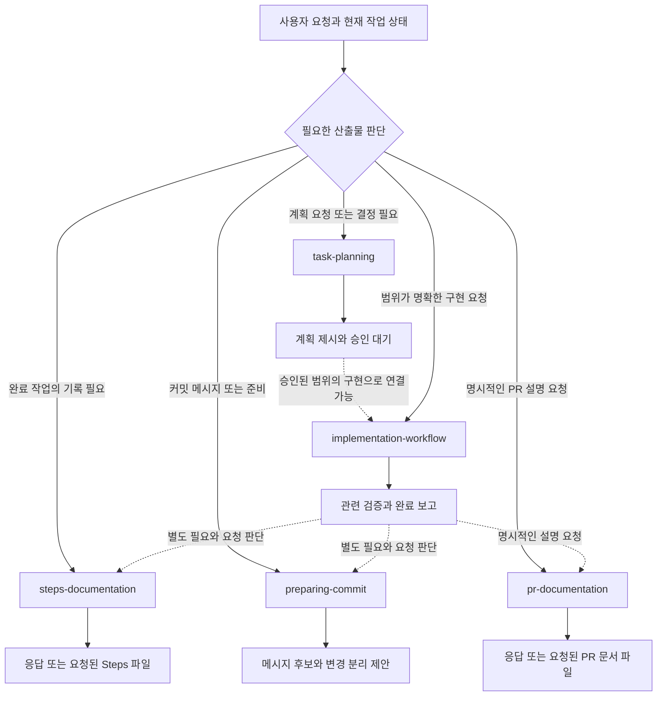

# 기존 스킬의 구성과 실행 흐름

이 문서는 `main`과 동일한 `d7c0887`의 스킬 5개를 분석한다. 여기에 제시한 흐름은 원문 규칙을 설명하는 모델이며, 새 실행 지침이나 v3 구현 명세가 아니다.

## 1. 파일 구성

분석 시작 시 Git 추적 파일은 다음 7개였다.

```text
plans-steps-pr-skills/
├── README.md
├── LICENSE
└── skills/
    ├── task-planning/SKILL.md              # 50줄: 구현 전 조사·결정·계획
    ├── implementation-workflow/SKILL.md    # 46줄: 요청/승인 계획 구현·검증
    ├── preparing-commit/SKILL.md           # 58줄: diff 분석·커밋 메시지 후보
    ├── steps-documentation/SKILL.md        # 50줄: 완료 사실의 장기 기록
    └── pr-documentation/SKILL.md           # 49줄: 리뷰어용 변경 설명
```

스킬 원문은 총 253줄이다. 모든 스킬은 YAML frontmatter의 `name`, `description`과 Markdown 본문으로 구성된다. 이 기준 버전에는 별도 라우터, `agents/openai.yaml`, 참조 문서, 실행 스크립트, 자산 템플릿, 플러그인 manifest, 테스트, CI가 없다. `preparing-commit`의 메시지 예시는 본문에 직접 들어 있다. 루트 README는 저장소 목적을 설명하는 두 줄이며 설치·사용·흐름 안내는 없다.

이 파일 배치는 **배포할 스킬 소스의 존재**를 보여 준다. 특정 환경에 설치되어 선택 가능한지는 별도 문제이며, 저장소의 `skills/` 폴더만으로 현재 세션의 자동 인식 여부를 보장할 수 없다.

## 2. 선택과 실행은 별도 단계다

일반적인 스킬 발견 과정에서는 모델이 먼저 이름과 description을 보고, 요청과 맞거나 명시적으로 호출된 경우 전체 지침을 읽는다. 따라서 본문이 정확해도 description이 과도하게 넓거나 좁으면 선택 단계에서 문제가 날 수 있다. [OpenAI 공식 문서: Skills](https://developers.openai.com/plugins/concepts/skills)

현재 저장소에 적용하면 다음 두 질문을 나눠야 한다.

| 단계 | 확인할 내용 | 현재 구성의 특징 |
|---|---|---|
| 선택 | 어떤 요청에 어떤 스킬을 읽는가? | 스킬별 description이 담당하며 중앙 우선순위표가 없음 |
| 수행 | 선택 후 무엇을 확인하고 어디까지 하는가? | 본문에 조사·산출물·중단·금지 규칙이 구체적으로 있음 |
| 환경 통제 | 실제 도구 실행을 누가 허용하는가? | 이 저장소에는 실행을 강제 차단하는 프로그램이 없음 |

여기서 말하는 **강제성은 스킬 문장의 지시 강도**다. 원문의 “수행하지 않습니다”가 도구 권한을 제거하거나 Git 작업을 기술적으로 막는다는 뜻은 아니다. 공식 지침도 스킬의 불명확한 지시·충돌을 점검하고 명시적인 사용자 지시의 우선순위를 분명히 하도록 안내한다. 따라서 아래 금지 항목은 해당 스킬의 기본 역할 계약으로 해석하며, 사용자의 명시적 지시나 상위 실행 지침을 무조건 무효화하는 규칙으로 확대하지 않는다. [OpenAI 공식 문서: Build skills](https://developers.openai.com/plugins/build/skills)

## 3. 전체 흐름



점선은 가능한 연결이며 자동 실행 순서가 아니다. 실제 중앙 라우터가 있는 것도 아니다. Steps·Commit·PR은 서로 선행 조건이 아니고, Plan이 없어도 구현·기록·PR 설명을 진행할 수 있다. 구현 스킬은 요청하지 않은 후속 스킬을 강제하지 않는다고 명시한다. 근거: [구현 핵심 원칙](../skills/implementation-workflow/SKILL.md#핵심-원칙), [구현 금지 사항](../skills/implementation-workflow/SKILL.md#금지-사항), [Steps 핵심 원칙](../skills/steps-documentation/SKILL.md#핵심-원칙), [PR 핵심 원칙](../skills/pr-documentation/SKILL.md#핵심-원칙).

일반적인 코드 설명·조사만 요청한 경우에는 이 다섯 스킬을 반드시 거칠 이유가 없다. 다만 이를 명시적으로 분류하는 공통 read-only 경로는 원문에 없다.

## 4. 각 스킬의 입출력과 종료 지점

| 스킬 | 주요 입력 | 산출물 | 기본 종료 지점 |
|---|---|---|---|
| [task-planning](skills/task-planning.md) | 요구사항, 코드·설정·테스트·Git 상태, 미결정 사항 | 구현 가능한 계획; 파일 요청 시 Plan 문서 | 사용자 승인·선택·수정·취소 대기 |
| [implementation-workflow](skills/implementation-workflow.md) | 승인 계획 또는 범위가 명확한 요청 | 실제 변경, 검증 결과, 완료 보고 | 구현·검증 보고까지 |
| [preparing-commit](skills/preparing-commit.md) | staged/unstaged diff, 안전하게 선별한 관련 untracked 파일 | Conventional Commit 후보, 변경 분리 제안 | 메시지 제안까지; 파일 수정도 하지 않음 |
| [steps-documentation](skills/steps-documentation.md) | 완료된 변경, 실제 검증 기록, 관련 Plan | 완료 사실 중심 설명; 파일 요청 시 Steps 문서 | 기록 작성까지 |
| [pr-documentation](skills/pr-documentation.md) | 가능하면 기준 브랜치 대비 전체 diff, 검증 기록 | 리뷰어용 PR 설명; 파일 요청 시 PR 문서 | 설명 작성까지; 실제 PR 발행 제외 |

## 5. 공통 원칙과 서로 다른 규칙

공통적으로 저장소 지침, 실제 변경 범위, 관련 있는 근거를 확인한다. 문서나 기억만으로 구현·검증 성공을 주장하지 않으며, 다른 단계 문서가 없다는 이유로 전체 작업을 막지 않는다. 기존 사용자 변경과 현재 작업을 구분한다.

| 항목 | 원문 규칙 | 분석상 의미 |
|---|---|---|
| 문서 저장 위치 | 저장소 지침 → 기존 관례 → 기본 경로 | 저장소 적응성이 있음 |
| 기본 경로 | Plan `docs/plans/`, Steps `docs/steps/`, PR `docs/pr/` | 역할별 분류이며 모든 폴더를 만들라는 뜻이 아님 |
| 문서 생성 | Plan·Steps·PR 모두 파일 작성 요청 시에만 저장 | 내용 요청과 파일 변경을 구분함 |
| 문서 연결 | 실제로 존재하고 현재 작업과 관련될 때만 | 번호·파일명 일치와 선행 문서 작성을 강제하지 않음 |
| 언어 | Steps·PR은 사용자 요청, 다음으로 저장소 관례 | 사용자 의도에 적응함 |
| 커밋 언어 | 기본 한글 | 기본값은 있으나 여러 출력 언어 정책의 통일 규정은 없음 |
| Plan 언어 | 별도의 언어 선택 규칙 없음 | 다른 문서 스킬과 명시 수준이 다름 |
| Git 후속 작업 | 각 스킬 역할에서 staging·commit·push·PR 생성 제외 | 메시지 작성과 실행 완료 사이 담당 기능이 비어 있음 |

위 경로·파일 생성·언어 규칙의 근거: [Plan 문서 위치](../skills/task-planning/SKILL.md#문서-위치), [Steps 문서 위치와 언어](../skills/steps-documentation/SKILL.md#문서-위치와-언어), [PR 문서 위치와 언어](../skills/pr-documentation/SKILL.md#문서-위치와-언어), [커밋 메시지 형식](../skills/preparing-commit/SKILL.md#메시지-형식).

## 6. 유지보수상 장점과 구조적 한계

**장점:** 각 파일이 짧고 목적별로 분리되어 있어 필요한 스킬만 읽기 쉽다. Plan·Steps·PR 의존성을 강제하지 않아 작은 작업도 바로 시작할 수 있다. 증거와 사실 중심 보고 규칙이 여러 단계에 일관되게 적용된다.

**한계:** 저장소 조사·Git 상태·문서보다 실물 우선·검증 사실성 규칙이 반복된다. 반복 자체가 오류는 아니지만 수정 시 여러 스킬의 표현이 달라질 수 있다. 반대로 이를 전부 공통 스킬로 옮기면 작은 작업에도 추가 호출이 필요하므로, v3에서 공통화 비용을 비교할 필요가 있다.

현재 가장 큰 공백은 “어느 스킬을 선택하는가”와 “사용자가 원하는 완료 지점까지 어떻게 연결하는가”다. 설명 전용·작은 수정·계획 선행·문서 저장·커밋 실행·PR 발행을 가르는 공통 기준과 복합 요청의 인계 규칙이 없다. 이 판단은 원문의 구조를 바탕으로 한 정적 평가이며 실제 오작동 횟수를 측정한 결과는 아니다.

다음 문서: [강제성과 간단한 요청 처리 평가](02-enforcement-and-request-evaluation.md).
