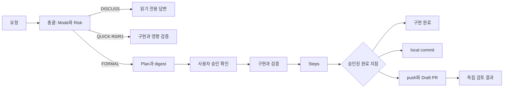

# v2 비교 맥락과 v3에 남길 교훈

분석일: 2026-09-27. 이 문서는 **main의 기존 5개 Skill을 분석하는 데 필요한 v2 비교 자료**다. v2를 복구하거나 그대로 채택하는 설계안은 아니다. v2 파일은 `git show`로 읽었고, 모델 행동 평가·설치·테스트를 새로 실행하지 않았다. 아래 PASS/FAIL과 토큰 수는 2026-08-15에 작성된 저장소 기록의 값이다.

## 1. 브랜치와 분석 대상

| 대상 | 확인한 상태 | 이번 작업에서의 의미 |
|---|---|---|
| `main` | `d7c0887e8d8fe2a4ca847c821a46f85bfba88e7a` | 기존 5개 Skill의 기준 원본 |
| `feature/gated-development-v2` | `eb70e3f72dcbe23bc76245e3b8ad12f841279154` | 보존하는 Plugin 실험 브랜치 |
| `feat/skill-v3-upgrade` | 분석 시작 시 `main`과 같은 커밋 | main 기반 문서화와 후속 v3 작업의 시작점 |
| `merge-base(main, v2)` | `d7c0887e8d8fe2a4ca847c821a46f85bfba88e7a` | v2도 현재 main에서 갈라짐 |
| `main...v2` 커밋 수 | main 전용 0개, v2 전용 2개 | v2의 큰 변경량과 커밋 수를 혼동하지 않아야 함 |

위 관계는 **로컬 Git 참조**를 확인한 결과다. 원격 브랜치 최신 상태를 확인하기 위한 fetch는 실행하지 않았다. v2의 checkout, merge, 파일 수정은 수행하지 않았다.

재확인 명령:

```powershell
git rev-parse main feature/gated-development-v2 feat/skill-v3-upgrade
git merge-base main feature/gated-development-v2
git rev-list --left-right --count main...feature/gated-development-v2
git show eb70e3f72dcbe23bc76245e3b8ad12f841279154:README.md
```

문서 끝의 v2 링크는 브랜치명이 아닌 해당 커밋 SHA에 고정했다. 원격에 커밋이 없거나 접근할 수 없으면 같은 SHA와 경로로 `git show <SHA>:<path>`를 실행해 로컬 원본을 읽을 수 있다.

## 2. main에서 v2로 바뀐 구조

main은 `skills/<name>/SKILL.md` 5개가 각각 작업을 맡는 구조다. [implementation-workflow](../skills/implementation-workflow/SKILL.md)는 승인 계획이 없더라도 명확한 사용자 요청을 작업 기준으로 허용하고, 관련 문서 부재를 중단 사유로 삼지 않는다. [task-planning](../skills/task-planning/SKILL.md)은 계획 파일을 요청받은 경우에만 저장소에 문서를 만든다.

v2는 총괄 1개와 전문 Skill 6개를 Plugin으로 묶었다. 원본은 `plugins/plans-steps-pr-skills/skills/`로 이동하고, 기존 5개 디렉터리는 v2에서 제거됐다. marketplace, Plugin manifest, 각 Skill의 `agents/openai.yaml`, 템플릿, 검증 정책, digest script, 테스트, CI가 추가됐다. [구조 근거: v2 README][v2-readme], [manifest][manifest], [marketplace][marketplace].

| 비교 축 | main | v2 |
|---|---|---|
| 작업 진입 | 목적별 독립 Skill | 총괄이 Mode·Risk·다음 전문 Skill 선택 |
| 작은 요청 | 명확한 요청이면 직접 구현 가능 | `QUICK` + R0/R1에서 Plan·Steps 기본 생략 |
| 큰 요청 | 필요한 승인 범위를 개별 판단 | R2/R3 또는 PR 목표이면 `FORMAL` |
| 계획 승인 | 사용자 승인 대기 | 사용자 메시지 + 현재 본문 digest 일치 |
| 기록 | 독립적인 문서 작성 요청 | FORMAL 구현 검증 이후 Steps를 상태 전이에 연결 |
| Git | 커밋 메시지 준비와 PR 문서 작성 중심 | 권한이 있으면 실제 local commit·push·Draft PR 수행 |
| 검토 | 전용 독립 PR 검토 Skill 없음 | 별도 검토 Skill, R3 fresh context 필수 |
| 배포·평가 | 5개 Markdown 원본 | Plugin 캐시·호출 metadata·정적/행동 평가 추가 |



이 흐름은 Skill 본문이 **모델에 요구하는 절차**다. Plugin 설치만으로 단계별 실행을 차단하는 외부 상태 머신이 생기는 것은 아니다. `allow_implicit_invocation: false`도 해당 Skill의 암묵 선택 정책이며, 모델 전체의 파일·Git 쓰기 권한을 제거하는 장치는 아니다.

## 3. v2의 7개 Skill과 강제 경계

각 이름은 고정 커밋의 본문으로 연결된다. 암묵 호출 값은 같은 디렉터리의 `agents/openai.yaml` 7개를 확인했다.

| Skill | 주된 책임 | 본문의 강한 요구 | 암묵 호출 |
|---|---|---|---|
| [running-gated-development][router] | Mode, Risk, 다음 전문 Skill 결정 | R2/R3는 FORMAL, 승인 없는 FORMAL은 계획으로 이동, merge 금지 | 켬 |
| [planning-approved-work][planning] | 조사, Plan, digest, 승인 기록 | 승인 전 Plan만 수정, 승인 메시지와 digest 확인, 중요 범위 변경 시 재승인 | 켬 |
| [implementing-with-risk-checks][implementation] | 승인 범위 또는 QUICK 구현 | 동작/문서 계약 RED→GREEN, 검증 ledger, 범위 확대 중단, Git 후속 작업 금지 | 끔 |
| [recording-implementation][recording] | 실제 결과와 검증 근거로 Steps 작성 | 미실행 검증을 완료로 쓰지 않음, R2/R3 깊이 구분, Git 후속 작업 금지 | 켬 |
| [committing-verified-work][commit] | 검증한 작업만 local commit | commit 권한 확인, 명시 경로 staging, 관련 없는 변경·비밀정보 제외 | 끔 |
| [publishing-pull-request][publish] | push, Draft PR 생성/갱신 | push와 PR 권한 구분, 전체 branch diff 확인, 생성 후 URL·Draft 상태 재확인 | 끔 |
| [validating-pull-request][validation] | Plan·Steps·diff·CI 기반 독립 판정 | R3 fresh context 없으면 MERGEABLE 금지, GitHub APPROVE·merge 금지 | 켬 |

main보다 규칙은 세밀해졌지만 강제성의 층위를 구분해야 한다. 본문에 쓰인 `Stop`, `Never`, 상태명은 모델 준수에 의존한다. digest script는 계산과 metadata 기록 조건을 검사하지만, 전달받은 `approval_evidence` 문자열이 실제 사용자 메시지인지 독립적으로 인증하지는 않는다. 최종 파일 쓰기 권한은 sandbox 같은 호스트 경계가 통제한다. [digest 구현][digest]

간단한 요청을 위한 `DISCUSS`/`QUICK` 분기는 분명한 개선 의도다. 다만 총괄의 description은 변경·구현·계획·검증·commit·게시·review 전반을 포함한다. planning의 `multi-file` 조건과 FORMAL의 PR 목표는 작은 작업에도 절차가 커질 여지를 만든다. 실제로 간단한 요청을 얼마나 정확히 처리하는지는 아래 제한된 기록만으로 일반화할 수 없다.

## 4. 기록에서 확인된 결과와 확인되지 않은 원인

| 항목 | 기존 기록의 관측 | 해석의 한계 |
|---|---|---|
| CLI 설치 | WindowsApps 실행 차단 후 npm CLI 설치로 해제; Plugin 2.0.0과 7개 디렉터리 확인 | 초기 실행 차단을 Plugin 자체 결함으로 볼 근거 없음 |
| 직접 호출 smoke | 명시 호출 후 `Mode: DISCUSS`, 전후 Git 상태 동일, exit 0 | 설치와 기본 호출 증거이며 자연어 자동 선택 전체 통과는 아님 |
| 최초 OAuth 라우팅 | `IMPLEMENTATION_REQUIRED`, `높음`, `superpowers:writing-plans` 반환; 구현은 중단 | enum·번들 Skill 계약 실패. 실제 총괄 활성화 또는 이름 출처는 미확인 |
| 총괄만 암묵 호출 후보 | 첫 실행은 구 캐시여서 판정 제외; 캐시 갱신 후 실행도 FAIL | 전문 Skill 경쟁이 원인이라는 가설은 입증되지 않음 |
| 명시 호출 contract | 본문을 읽은 후 `FORMAL`, `R3`, `planning-approved-work` 반환 | 읽기 금지 평가 조건과 본문 조사 지시가 충돌해 조건 조정 후 GREEN |
| 자연어 implicit discovery | 저장소를 조사한 뒤 Skill 자체 수정 patch 시도; sandbox가 거절; 최종 결과도 라우팅 아님 | 쓰기 차단은 sandbox의 성과이며 라우팅 gate 준수 증거가 아님 |
| clean profile preflight | 소스/캐시 해시 일치, 대상 Plugin 1개, 대상 implicit Skill 4개, fixture clean | `BLOCKED_AUTH`, behavioral 모델 호출 0회. 격리 행동 성공 여부 미확인 |
| 전체 release 검증 | pressure suite 전체, standalone 설치, 실제 GitHub Actions는 미완료로 기록 | 정적 검사·설치 smoke만으로 release-ready 판정 불가 |

설치·smoke는 [plugin-install 기록][install]에, 후보별 평가와 판정 변경은 [scenario README][scenarios]에, 최신 인계 상태는 [handoff][handoff]에 정리되어 있다. 이번 분석은 해당 Markdown 기록을 검토한 것으로, 모든 모델 세션의 원본 trace를 독립적으로 재검증한 것은 아니다.

비용 문제도 기록에 드러난다. 직접 호출 smoke는 48,782토큰, 이후 explicit contract는 24,602토큰, implicit discovery는 61,758토큰을 사용했다고 적혀 있다. 마지막 두 실행 합계는 86,360토큰이다. 이는 당시 실행 사례의 보고값이며 다른 모델·현재 호스트·v3의 비용 예측값은 아니다. [설치 기록][install], [평가 기록][scenarios]

handoff는 **Plugin 자체 결함, 모델 영향, Skill 경쟁 영향, `AGENTS.md` bridge 효과가 아직 분리되지 않았다**고 명시한다. 따라서 사용자가 경험한 모든 문제를 “Plugin 충돌”이나 “암묵 호출 Skill이 많아서 생긴 문제”로 확정하지 않는다. description 축약 경고는 관측됐지만, 그것이 실패의 충분한 원인이었다는 증거도 없다. [handoff][handoff], [평가 기록][scenarios]

별도로, Steps에는 재승인 때 `refresh`가 이전 `approved_digest`를 유지하여 `approve`가 실패했고, 이전 증거를 다른 metadata로 보존한 뒤 현재 승인 슬롯을 비우는 대응을 했다고 기록되어 있다. script도 `approved_digest`가 있으면 새 승인을 거부한다. **재승인 경로가 기본 명령만으로 매끄럽게 이어지지 않는 한계**는 관측 기록과 정적 코드 양쪽에서 확인된다. [Steps의 Plan digest 설명][steps], [script][digest]

## 5. 현재 세션의 설치 캐시와 main을 구분해야 하는 이유

이번 세션에는 `C:/Users/bigbros/.codex/plugins/cache/yellow-pang-workflows/plans-steps-pr-skills/2.0.0/skills`에 설치된 v2 계열 Skill이 노출되어 있다. 해당 캐시 디렉터리에 7개 Skill 폴더가 존재함도 확인했다. 반면 현재 저장소 main 원본은 독립 Skill 5개다.

따라서 “현재 Skill”은 **저장소의 분석 대상**과 **이번 세션에서 선택될 수 있는 설치본**을 구분해 기록해야 한다. main으로 브랜치를 바꾸는 것은 설치 캐시 제거·갱신과 별개의 작업이다. 이번 문서에서는 main을 주 분석 대상으로, v2 브랜치를 비교 자료로 삼았으며 캐시를 변경하지 않았다. 현재 캐시와 v2 HEAD의 전체 파일 해시 일치는 이번 분석에서 확인하지 않았다.

v2 기록에는 수정 후보를 실행했지만 캐시가 구버전이어서 평가를 무효 처리한 실제 사례가 있다. v3 평가에서는 먼저 원본 SHA, 캐시 해시, 노출된 Skill 목록, 실제 읽힌 Skill 경로를 남기는 편이 결과 해석에 유리하다. [평가 기록][scenarios]

## 6. v3에 가져올 후보와 반복을 피할 후보

아래는 **정적 분석과 기존 기록에 근거한 설계 제안**이며, 확정된 v3 요구사항이나 구현 승인을 뜻하지 않는다.

| 구분 | 후보 | 이유 |
|---|---|---|
| 가져오기 | 질문·변경 요청 구분, 작업 크기와 위험 분리 | 설명 요청의 과잉 실행과 작은 고위험 변경의 과소평가를 각각 다룸 |
| 가져오기 | 실제 diff·명령 결과 우선, 모르는 실패 원인 명시 | 계획·문서가 실행 사실을 대신하는 문제를 줄임 |
| 가져오기 | 같은 환경·입력의 유효한 검증 근거 재사용 | 반복 회귀 비용 문제에 직접 대응 |
| 가져오기 | 구현·commit·push·PR의 완료 지점 명시 | 요청 범위와 외부 쓰기 권한을 구분하는 데 유용 |
| 가져오기 | explicit 본문 준수와 implicit 발견 평가 분리 | “선택하지 못함”과 “읽고도 따르지 못함”을 구분 |
| 가져오기 | main의 문서 선택성과 독립 사용성 | 간단한 요청을 문서·승인 절차로 불필요하게 확대하지 않음 |
| 재검토 | 모든 FORMAL 작업의 digest 재승인 | 엄격한 버전 고정의 가치와 재승인 장애·운영 비용을 함께 평가해야 함 |
| 재검토 | 모든 문서·metadata에서 먼저 RED 관측 | 비코드 변경의 성격에 비해 검증 절차가 무거워질 수 있음 |
| 피하기 | 자연어 발견 실패 직후 router-only 암묵 호출로 단정 | 해당 후보는 당시 행동 평가를 통과하지 못했고 원인도 미분리 |
| 피하기 | Skill 문구·패키지·캐시·평가 조건을 한 번에 변경 | 어떤 변화가 결과를 만들었는지 추적하기 어려움 |
| 피하기 | 정적 GREEN을 전체 행동 성공으로 확대 | 기존 기록에서 정적 계약 통과와 discovery 실패가 함께 존재 |
| 피하기 | 큰 저장소 조사와 여러 모델 재시도를 기본 평가로 사용 | 작은 독립 fixture, 실행 횟수·시간·비용 기록부터 정할 필요 |

v3의 첫 행동 평가에는 오탈자 수정, 설명만 요청, 명확한 한 파일 버그 수정, 작은 PR 문서 작성, 승인 후 후속 요청처럼 **일상적인 짧은 요청**도 포함할 필요가 있다. v2의 [12개 pressure 시나리오][pressure]는 고위험 우회 방지에 집중되어 있어, 단순 요청의 불필요한 정지·과도한 조사·반복 승인까지 충분히 대표한다고 보기는 어렵다.

[v2-readme]: https://github.com/yellow-pang/plans-steps-pr-skills/blob/eb70e3f72dcbe23bc76245e3b8ad12f841279154/README.md
[manifest]: https://github.com/yellow-pang/plans-steps-pr-skills/blob/eb70e3f72dcbe23bc76245e3b8ad12f841279154/plugins/plans-steps-pr-skills/.codex-plugin/plugin.json
[marketplace]: https://github.com/yellow-pang/plans-steps-pr-skills/blob/eb70e3f72dcbe23bc76245e3b8ad12f841279154/.agents/plugins/marketplace.json
[router]: https://github.com/yellow-pang/plans-steps-pr-skills/blob/eb70e3f72dcbe23bc76245e3b8ad12f841279154/plugins/plans-steps-pr-skills/skills/running-gated-development/SKILL.md
[planning]: https://github.com/yellow-pang/plans-steps-pr-skills/blob/eb70e3f72dcbe23bc76245e3b8ad12f841279154/plugins/plans-steps-pr-skills/skills/planning-approved-work/SKILL.md
[implementation]: https://github.com/yellow-pang/plans-steps-pr-skills/blob/eb70e3f72dcbe23bc76245e3b8ad12f841279154/plugins/plans-steps-pr-skills/skills/implementing-with-risk-checks/SKILL.md
[recording]: https://github.com/yellow-pang/plans-steps-pr-skills/blob/eb70e3f72dcbe23bc76245e3b8ad12f841279154/plugins/plans-steps-pr-skills/skills/recording-implementation/SKILL.md
[commit]: https://github.com/yellow-pang/plans-steps-pr-skills/blob/eb70e3f72dcbe23bc76245e3b8ad12f841279154/plugins/plans-steps-pr-skills/skills/committing-verified-work/SKILL.md
[publish]: https://github.com/yellow-pang/plans-steps-pr-skills/blob/eb70e3f72dcbe23bc76245e3b8ad12f841279154/plugins/plans-steps-pr-skills/skills/publishing-pull-request/SKILL.md
[validation]: https://github.com/yellow-pang/plans-steps-pr-skills/blob/eb70e3f72dcbe23bc76245e3b8ad12f841279154/plugins/plans-steps-pr-skills/skills/validating-pull-request/SKILL.md
[digest]: https://github.com/yellow-pang/plans-steps-pr-skills/blob/eb70e3f72dcbe23bc76245e3b8ad12f841279154/plugins/plans-steps-pr-skills/skills/planning-approved-work/scripts/plan_digest.py
[install]: https://github.com/yellow-pang/plans-steps-pr-skills/blob/eb70e3f72dcbe23bc76245e3b8ad12f841279154/tests/scenarios/results/2026-08-15/plugin-install.md
[scenarios]: https://github.com/yellow-pang/plans-steps-pr-skills/blob/eb70e3f72dcbe23bc76245e3b8ad12f841279154/tests/scenarios/README.md
[handoff]: https://github.com/yellow-pang/plans-steps-pr-skills/blob/eb70e3f72dcbe23bc76245e3b8ad12f841279154/docs/handoffs/2026-08-15-gate-2b-clean-evaluation.md
[steps]: https://github.com/yellow-pang/plans-steps-pr-skills/blob/eb70e3f72dcbe23bc76245e3b8ad12f841279154/docs/steps/2026-08-15-gated-development-v2.md
[pressure]: https://github.com/yellow-pang/plans-steps-pr-skills/blob/eb70e3f72dcbe23bc76245e3b8ad12f841279154/tests/scenarios/workflow-pressure-cases.yaml
