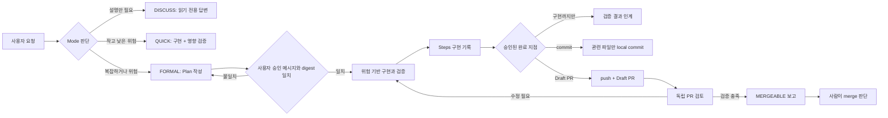
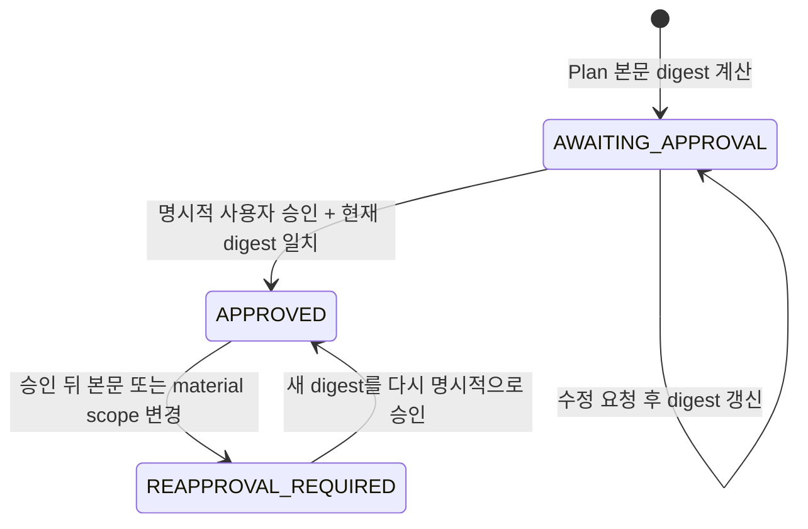

# 구현 기록: Gated Development Workflow v2

- 문서 성격: 처음 보는 사용자와 유지보수자를 위한 통합형 구현 설명서
- 현재 상태: 로컬 구조·script·schema 계약과 Plugin 설치·기본 호출 smoke 완료, 전체 행동 검증과 GitHub CI 진행 전
- 대상 버전: `plans-steps-pr-skills` Plugin `2.0.0`
- 작업 브랜치: `feature/gated-development-v2`

## 1. 한눈에 보기

이 프로젝트는 개발 에이전트가 곧바로 코드를 수정하지 않고, 요청의 성격과 위험에 맞춰 다음 행동을 선택하도록 만드는 7개 Agent Skill 묶음이다.

쉽게 말하면 다음 문제를 해결한다.

- 구현 방법만 물었는데 파일이 바뀌는 일을 막는다.
- 큰 작업은 사용자가 Plan을 승인하기 전까지 구현을 시작하지 않는다.
- 작은 수정에 매번 전체 테스트를 반복하지 않고, 변경과 위험에 맞는 검증을 선택한다.
- 구현 결과를 Steps, commit, Draft PR로 일관되게 연결한다.
- PR을 만든 에이전트와 검토하는 관점을 분리하고 자동 merge를 금지한다.

### 변경 전과 변경 후

| 구분 | v1 | v2 |
|---|---|---|
| 진입점 | 서로 독립적인 문서 중심 Skill 5개 | 전체 상태를 조정하는 총괄 1개와 전문 Skill 6개 |
| 계획 승인 | Plan 작성 중심 | 사용자 승인 메시지와 Plan digest가 모두 일치해야 구현 가능 |
| 구현 검증 | 별도 통합 정책 없음 | Mode와 R0~R3 Risk를 분리하고 검증 비용을 위험에 맞춤 |
| 전체 회귀 | 반복 시점이 명확하지 않음 | 같은 HEAD의 유효한 증거를 재사용하고 마지막 위험 경계에서 실행 |
| 구현 기록 | Steps 양식 제공 | 실제 diff와 verification ledger를 근거로 깊이를 조절 |
| commit·PR | 문서 작성 보조 | 명시 권한이 있을 때만 실제 local commit과 Draft PR 수행 |
| PR 검토 | 작성 흐름과 분리되지 않음 | Plan·Steps·diff·CI만 보는 독립 검토 Skill 제공 |
| 배포 | 개별 Skill 중심 | repo marketplace와 중첩 Plugin 패키지 제공 |

## 2. 전체 흐름



총괄 Skill은 모든 세부 작업을 직접 하지 않는다. 현재 상태를 확인하고 다음 전문 Skill 하나만 선택한 뒤, 결과를 다시 확인한다. 이 구조가 계획·구현·문서·Git 작업의 권한이 섞이는 것을 막는다.

## 3. Mode와 Risk를 나눈 이유

`Mode`는 작업에 사용할 절차의 크기이고, `Risk`는 실패했을 때의 영향이다. 한 줄 변경이어도 dependency나 권한을 바꾸면 위험이 높을 수 있으므로 두 값을 따로 판단한다.

### Mode

| Mode | 언제 쓰는가 | 파일 변경 | Plan / Steps |
|---|---|---:|---|
| `DISCUSS` | 구조, 구현 방법, 대안만 질문 | 없음 | 없음 |
| `QUICK` | 범위가 분명한 R0/R1 변경 | 허용 | 기본 생략, 관련 검증은 필수 |
| `FORMAL` | R2/R3, 다중 모듈, 설계 선택, PR 목표 | 승인 뒤 허용 | Plan과 Steps 필수 |

### Risk

| Risk | 예시 | 개발 중 검증 | 마지막 경계 |
|---:|---|---|---|
| `R0` | 문서, 주석, 동작 없는 metadata | 형식·schema·링크·렌더링 | 영향 검사 |
| `R1` | 고립된 UI, 재현 가능한 일반 버그 | 동작 RED→GREEN, 영향 모듈 | 영향 모듈 suite |
| `R2` | 공개 API, dependency, 여러 모듈, runtime/build | 단위·통합·타입·빌드 | 느린 전체 검증을 보통 CI에서 한 번 |
| `R3` | 인증, 권한, 결제, migration, 데이터 손실 | 경계·오류·통합·회귀 | 전체 회귀, CI, 독립 검토 |

사용자가 `QUICK`을 요청해도 실제 변경이 R2/R3이면 `FORMAL`로 올린다. 반대로 단순 문서 수정에 코드용 TDD와 전체 회귀를 강제하지 않고 문서 계약 검사를 사용한다.

## 4. 실제 사용 예

### 구현 방향만 질문

```text
로그인 만료 처리를 어떻게 구현할 생각인지 설명해줘.
```

총괄 Skill은 `DISCUSS`로 분류하고 파일이나 Git을 수정하지 않은 채 현재 구조와 구현 방향만 설명해야 한다.

### 작은 오류 수정

```text
$running-gated-development 이 고립된 버튼 표시 오류를 QUICK으로 고치고 관련 테스트만 실행해줘.
```

R0/R1 범위가 맞으면 Plan 없이 구현할 수 있지만, 변경 동작과 직접 영향 검사는 생략하지 않는다.

### 위험한 기능을 Draft PR까지 진행

```text
$running-gated-development 회원 권한 변경 기능을 계획부터 Draft PR까지 진행해줘.
```

권한 변경은 R3이므로 Plan 승인, digest 확인, 구현, Steps, commit, push, Draft PR, fresh-context 검토가 순서대로 필요하다. 승인하지 않은 다음 단계는 자동으로 수행하지 않는다.

## 5. 7개 Skill과 책임

| Skill | 입력 | 결과 | 중요한 경계 | 암묵 호출 |
|---|---|---|---|---:|
| `running-gated-development` | 사용자 요청, 저장소·Plan·Git 상태 | Mode, Risk, 현재 상태, 다음 전문 Skill | 다른 end-to-end 총괄 흐름과 경쟁하지 않음 | 켬 |
| `planning-approved-work` | 요청 방향, 프로젝트 조사 | 승인 가능한 Plan과 digest | 승인 전 Plan 외 파일 변경 금지 | 켬 |
| `implementing-with-risk-checks` | 승인 Plan 또는 QUICK 계약 | 구현 결과와 verification ledger | commit·push·PR 금지 | 끔 |
| `recording-implementation` | diff, 코드, 검증 결과, Plan | 사람이 읽을 수 있는 Steps | 실행하지 않은 내용을 완료로 기록하지 않음 | 켬 |
| `committing-verified-work` | commit 권한, 검증된 diff | 의도적으로 분리된 local commit | 관련 없는 파일과 push 제외 | 끔 |
| `publishing-pull-request` | push·PR 권한, branch diff, Plan, Steps | 새 Draft PR 또는 기존 Draft 갱신 | APPROVE·merge·자동 merge 금지 | 끔 |
| `validating-pull-request` | Plan, Steps, PR diff, CI 증거 | `MERGEABLE`, `CHANGES_REQUIRED`, `REVIEW_REQUIRED` | R3 fresh context 필수, GitHub APPROVE 금지 | 켬 |

암묵 호출이 꺼진 세 Skill은 구현, Git commit, GitHub 변경처럼 쓰기 권한이 크다. 사용자가 `$skill-name`으로 직접 부르거나 총괄 Skill이 승인 상태를 확인한 뒤 명시적으로 선택해야 한다.

## 6. Plan digest 승인 방식

Plan 파일에 `state: APPROVED`라고 적혀 있다는 사실만으로는 승인이 아니다. 사용자 메시지와 현재 Plan 본문이 같은 버전이라는 증거가 함께 있어야 한다.



승인 순서는 고정되어 있다.

1. 특정 Plan 또는 digest를 승인하는 사용자 메시지를 확인한다.
2. 현재 Plan의 Markdown 본문 digest를 다시 계산한다.
3. 사용자가 승인한 digest와 현재 digest가 같은지 확인한다.
4. 그 뒤에만 승인자·시각·증거와 `APPROVED` 상태를 기록한다.

`plan_digest.py`는 YAML frontmatter를 digest에서 제외하고, 줄바꿈을 LF로 정규화한 UTF-8 본문에 SHA-256을 적용한다.

| 함수·명령 | 역할 | 실패 조건 |
|---|---|---|
| `compute_body_digest(text)` / `digest` | 현재 본문 digest 계산 | frontmatter 없음·미종료 |
| `refresh_plan(text)` / `refresh` | digest 갱신과 승인 상태 재평가 | 잘못된 frontmatter |
| `approve_plan(...)` / `approve` | 명시 승인 증거와 digest가 맞을 때 metadata 기록 | 승인 증거 없음, digest 불일치, 중복 승인 |

승인 뒤 공개 API, 저장 형식, schema, dependency, 보안 경계, 파일 범위, 완료 지점 또는 검증 수준이 달라지면 `REAPPROVAL_REQUIRED`로 멈춘다.

## 7. 위험 기반 검증과 전체 회귀 절약

이 프로젝트는 테스트를 적게 하는 방식이 아니라, 같은 증거를 이유 없이 반복하지 않는 방식이다.

- 새 동작과 재현 가능한 버그는 관찰 가능한 동작 단위 RED→GREEN을 사용한다.
- 문서와 metadata는 schema, 링크, 렌더링, 구조 계약처럼 대상에 맞는 검사를 먼저 실패시킨다.
- 실패한 검사와 직접 영향 검사는 구현 중 빠르게 반복한다.
- 느린 전체 회귀는 Risk와 저장소 정책에 따라 마지막 경계에서 실행한다.
- 같은 HEAD, 같은 관련 환경, 같은 입력에서 통과한 명령은 증거가 무효화되지 않았다면 재사용한다.
- source, lockfile, 설정, 생성물, 환경 또는 test selection이 바뀌면 이전 증거를 폐기한다.
- 실패 원인을 신규 회귀, 입증된 기존 실패, 환경·외부 문제, `unknown provenance`로 구분한다.

### Verification ledger

| Field | 기록 내용 |
|---|---|
| command | 실제 실행한 정확한 명령 또는 결정적 작업 |
| result | exit status와 pass·fail·blocked 요약 |
| HEAD | commit SHA 또는 working-tree diff 식별 |
| environment | local·CI, OS, 관련 runtime |
| executed_at | ISO-8601 시각 |
| scope | 검증한 동작·모듈·suite |
| provenance | 현재 변경·기존·환경·unknown |

테스트 파일이 존재한다는 사실과 테스트가 현재 변경에서 통과했다는 사실은 다르다. ledger에는 실제 실행한 명령만 기록한다.

## 8. 결과물이 연결되는 방법

| 결과물 | 근거 | 독자가 확인할 내용 |
|---|---|---|
| Plan | 프로젝트 조사, 사용자 결정, 예상 영향 | 무엇을 왜 만들고 어디까지 승인하는가 |
| Steps | 실제 diff, 현재 코드, 검증 ledger, Git·CI | 실제로 무엇이 어떻게 구현됐는가 |
| Commit | 명시적으로 stage한 검증된 경로 | 한 목적 단위로 되돌릴 수 있는가 |
| Draft PR | merge-base부터 HEAD까지의 branch diff | 배경, 주요 변화, 영향, 검증, 리뷰 지점, 롤백 |
| 독립 검토 | Plan, Steps, PR diff, test·CI 증거 | 승인 범위와 실제 변경이 맞고 남은 결함이 없는가 |

Steps는 템플릿을 채우기 위한 문서가 아니다. R2에서는 필요한 섹션만 남기고, R3에서는 계약·데이터·상태 변화, verification ledger, 미실행 검증과 제한을 모두 남긴다. Mermaid는 구성 요소·분기·상태 전이가 세 개 이상일 때만 사용한다.

## 9. 패키지 구조

```text
plans-steps-pr-skills/
├─ .agents/plugins/marketplace.json
├─ plugins/plans-steps-pr-skills/
│  ├─ .codex-plugin/plugin.json
│  └─ skills/
│     ├─ running-gated-development/
│     ├─ planning-approved-work/
│     ├─ implementing-with-risk-checks/
│     ├─ recording-implementation/
│     ├─ committing-verified-work/
│     ├─ publishing-pull-request/
│     └─ validating-pull-request/
├─ tests/
│  ├─ test_repository_contract.py
│  ├─ test_plan_digest.py
│  └─ scenarios/
├─ docs/superpowers/specs/
├─ docs/superpowers/plans/
├─ docs/steps/
├─ .github/PULL_REQUEST_TEMPLATE.md
└─ .github/workflows/validate-plugin.yml
```

Skill 원본은 `plugins/plans-steps-pr-skills/skills/`에 한 벌만 둔다. 동일한 Skill을 여러 위치에 복사하면 어느 지침이 실행됐는지 불분명해지므로 저장소의 `.agents/skills/`에 다시 복제하지 않는다.

### 주요 파일별 구현 내용

| 파일 | 기능 | 구현 핵심 |
|---|---|---|
| `.agents/plugins/marketplace.json` | 저장소 marketplace 진입점 | 로컬 nested Plugin 경로와 설치 정책 선언 |
| `.codex-plugin/plugin.json` | Plugin identity와 UI metadata | version `2.0.0`, MIT, Skill-only package |
| `skills/*/SKILL.md` | 모델이 따르는 workflow 규칙 | 각 Skill의 입력·출력·권한·중단 조건 분리 |
| `skills/*/agents/openai.yaml` | 표시 이름·설명·호출 정책 | 쓰기 권한이 큰 Skill의 암묵 호출 차단 |
| `plan_digest.py` | Plan 승인 버전 고정 | 표준 라이브러리만 사용한 SHA-256과 승인 순서 검증 |
| `verification-policy.md` | R0~R3와 regression budget | 같은 HEAD 증거 재사용과 failure provenance 정의 |
| `assets/plan-template.md` | 승인 가능한 Plan 기본 구조 | 범위, 결정, 흐름, 위험, 롤백, 검증, 완료 지점 |
| `assets/steps-template.md` | 구현 기록 구조 | R2 compact와 R3 full 구분 |
| `assets/commit-template.md` | 일관된 commit 메시지 | 실제 변경과 Verification을 한 목적에 연결 |
| `assets/pr-template.md` | Draft PR 본문 | Summary부터 Plan and Steps까지 고정 순서 |
| `test_repository_contract.py` | 저장소·정책 회귀 방지 | package, Skill metadata, 문서, CI, 링크 계약 |
| `test_plan_digest.py` | 승인 알고리즘 회귀 방지 | 줄바꿈, 본문 변경, 승인 증거, mismatch, 중복 승인 |
| `validate-plugin.yml` | GitHub deterministic 검증 | Python 3.12, unittest, 공식 `skills-ref` validator |

## 10. 기술적 경계와 상태

총괄 Skill이 다루는 대표 상태는 다음과 같다.

| 상태 | 뜻 | 다음 행동 |
|---|---|---|
| `AWAITING_APPROVAL` | Plan은 있으나 현재 본문이 승인되지 않음 | 사용자가 digest를 명시 승인 |
| `APPROVED` | 승인 메시지와 현재 digest 일치 | 위험 기반 구현 시작 가능 |
| `REAPPROVAL_REQUIRED` | 승인 뒤 material change 발생 | 구현 중단 후 Plan 갱신·재승인 |
| `VERIFYING` | 관련 검증 또는 실패 원인 확인 중 | 영향 검사와 provenance 확인 |
| `DOCUMENTED` | FORMAL 구현과 Steps 기록 완료 | 승인된 완료 지점 확인 |
| `BLOCKED` | 권한·도구·환경·외부 상태가 다음 행동을 막음 | 근거와 필요한 권한 보고 |
| `REVIEW_REQUIRED` | CI 또는 독립 검토 증거 부족 | 필요한 fresh review 수행 |
| `CHANGES_REQUIRED` | 검증 또는 리뷰에서 결함 발견 | 승인 범위 안에서 수정 |
| `MERGEABLE` | 현재 증거상 병합 조건 충족 | 사람이 merge 여부 판단 |

`MERGEABLE`은 merge 명령이 아니다. 검토 Skill은 GitHub APPROVE, conversation resolution, ready-for-review 변경, auto-merge와 merge를 수행하지 않는다.

## 11. 자동 검증 구조

로컬 deterministic suite는 다음을 확인한다.

- marketplace와 Plugin manifest 구조
- 정확히 7개인 Skill 목록과 frontmatter
- 각 `agents/openai.yaml`의 암묵 호출 정책
- 총괄·승인·검증·기록·commit·PR·검토의 핵심 안전 계약
- Plan digest의 줄바꿈 정규화와 승인 증거 순서
- 템플릿 필수 섹션
- README, 라이선스 고지, GitHub workflow
- placeholder와 깨진 로컬 Markdown 링크
- 기존 v1 `SKILL.md` 제거

GitHub Actions는 pull request와 `main` push에서 unittest를 실행한 뒤 공식 Agent Skills reference validator로 7개 Skill을 검사한다. workflow 권한은 `contents: read`로 제한하고 `pull_request_target`에서 불신 PR 코드를 실행하지 않는다.

정적 GREEN은 “모델이 실제 요청에서 항상 올바르게 행동한다”는 뜻이 아니다. 그래서 설치된 Plugin의 direct·indirect·negative·boundary prompt를 별도의 Release Gate로 둔다. 이 구분은 [공식 OpenAI Plugin 테스트 안내](https://developers.openai.com/plugins/deploy/connect-chatgpt)의 complete plugin 평가 방식과도 맞는다.

## 12. 완료된 검증

### 이 문서 작성 전 확인된 로컬 증거

| 검증 | 결과 | 범위 |
|---|---|---|
| `python -B -m unittest discover -s tests -p "test_*.py" -v` | 24개 PASS | 문서 추가 전 deterministic baseline |
| Skill validator | 7개 valid | 모든 배포 Skill 구조·metadata |
| Plugin validator | PASS | nested Plugin manifest와 package |
| Plan digest CLI | `sha256:` 출력, exit 0 | LF 정규화된 Plan 본문 digest |
| `git diff --check` | exit 0 | whitespace 오류 없음, README 줄바꿈 경고만 존재 |
| source→target SHA-256 비교 | 33개 일치 | 작업본을 실제 `.git` 저장소로 옮긴 파일 |

이 표의 24개는 새 구현 기록 계약을 추가하기 전 baseline이다. 문서와 README 변경 뒤 전체 suite를 다시 실행한 결과는 이 문서의 후속 verification ledger에 별도로 기록한다.

### 구현 기록 반영 후 verification ledger

| Command | Result | HEAD / environment | Scope | Executed at |
|---|---|---|---|---|
| `python -B -m unittest discover -s tests -p "test_*.py" -v` | exit 0, 25개 PASS | `d7c0887`, Windows local working tree | digest 10개 + repository contract 15개 | 2026-08-15 14:13 KST |
| 7개 Skill에 `quick_validate.py` 실행 | 7개 valid | Windows local working tree | 모든 배포 Skill 구조·metadata | 2026-08-15 14:13 KST |
| Plugin에 `validate_plugin.py` 실행 | PASS | Windows local working tree | `plans-steps-pr-skills` package | 2026-08-15 14:13 KST |
| `plan_digest.py digest .../plan-template.md` | exit 0, `sha256:66df946a49a03195d141fe00ef64557a9aaf36861fc8d5f7a73dd8eb9f6ad8e3` | Windows local working tree | Plan 본문 digest CLI | 2026-08-15 14:13 KST |
| `git diff --check` | exit 0 | `d7c0887`, Windows local working tree | 현재 전체 diff whitespace | 2026-08-15 14:13 KST |
| `codex --version` | exit 0, `codex-cli 0.147.0` | npm CLI on Windows | 실행 가능한 Plugin CLI 확인 | 2026-08-15 15:00 KST |
| Marketplace 등록 + Plugin 설치 + `codex plugin list` | exit 0, `installed, enabled`, version `2.0.0` | `yellow-pang-workflows` local marketplace | 설치 캐시와 7개 Skill 디렉터리 | 2026-08-15 15:03 KST |
| `$running-gated-development` read-only ephemeral smoke | exit 0, `Mode: DISCUSS`, Git 상태 전후 동일, 48,782 tokens | Codex 0.147.0, `gpt-5.6-sol` | 새 작업의 직접 호출과 무변경 경계 | 2026-08-15 15:06 KST |
| `python -B -m unittest discover -s tests -p "test_*.py" -v` | exit 0, 25개 PASS | Windows local working tree | 설치 증거 문서 반영 후 전체 deterministic 계약 | 2026-08-15 15:09 KST |
| 7개 Skill `quick_validate.py` + Plugin `validate_plugin.py` | 7개 valid, Plugin PASS | Python 3.10 UTF-8 mode, isolated PyYAML 6.0.3 | 배포 Skill과 Plugin package 재검증 | 2026-08-15 15:11 KST |
| `git diff --check` | exit 0 | Windows local working tree | 설치 증거 문서 반영 후 전체 diff whitespace | 2026-08-15 15:09 KST |

README의 LF→CRLF 안내는 Windows에서 Git이 다음 checkout·write 때 적용할 줄바꿈 변환 경고이며, `git diff --check`의 오류는 아니다.

PATH의 Python에는 validator가 요구하는 PyYAML이 없어 첫 재실행이 실패했다. 저장소 의존성을 바꾸지 않고 현재 Codex 작업의 격리 폴더에 PyYAML을 설치했으며, Windows `cp949` 대신 `python -X utf8`로 UTF-8 Skill 문서를 읽게 한 뒤 validator를 통과시켰다. 이 환경 보완은 Plugin runtime dependency가 아니다.

## 13. 미완료 Release Gate

Gate 상태는 다음 네 값으로 기록한다.

- `PASS`: 실제 실행 증거가 통과 조건을 만족함
- `FAIL`: 실행됐지만 기대 동작을 만족하지 못함
- `BLOCKED_ENVIRONMENT`: 현재 권한·도구·host가 실행을 허용하지 않음
- `PARTIAL`: 일부 통과 증거가 있으나 Gate의 전체 표본이나 조건은 아직 충족하지 않음

실행하지 않은 Gate는 `NOT_RUN`으로 유지한다.

| 우선순위 | Gate | 현재 상태 | 통과 조건 | 남길 증거 | 필요한 경계 |
|---:|---|---|---|---|---|
| 1 | Plugin 설치와 7개 Skill 노출 | `PASS` | 로컬 marketplace Plugin 설치 후 새 작업에서 Skill 로드 | host·버전·설치 단계·Skill 목록 | Codex CLI와 설치 캐시 |
| 2 | 총괄→전문 Skill과 암묵 호출 정책 | `PARTIAL` | 명시 라우팅 성공, 비암묵 Skill이 일반 요청에서 단독 실행되지 않음 | prompt·선택 Skill·mutation 결과 | 설치된 Plugin과 새 작업 |
| 3 | 10개 pressure scenario 전후 비교 | `NOT_RUN` | Skill 없음/있음 각 10회 fresh context 결과가 expected 계약 충족 | 20개 원본 입력·출력과 판정표 | fresh context 실행 수단 |
| 4 | standalone Skill 설치 | `NOT_RUN` | Plugin 없이 대표 Skill 설치·발견·직접 호출·정리 성공 | 설치 위치·호출 결과·정리 결과 | 격리된 Skill 설치 대상 |
| 5 | 실제 GitHub Actions | `NOT_RUN` | 실제 branch 또는 Draft PR의 validation job 전체 통과 | run URL·commit SHA·job 결과 | local commit, push, PR 별도 승인 |

### Gate 1: Plugin 설치와 Skill 노출

공식 OpenAI 문서는 skills-only Plugin도 local marketplace에 추가하고 Plugins Directory에서 설치한 뒤 새 대화에서 대표 요청을 평가하도록 안내한다. 다만 local·repo marketplace 가용성은 surface에 따라 달라질 수 있다.

초기에는 `codex`가 다음 Microsoft Store package 파일로만 해석되어 프로세스 시작이 `Access is denied`로 차단됐다.

```text
C:\Program Files\WindowsApps\OpenAI.Codex_26.810.6296.0_x64__2p2nqsd0c76g0\app\resources\codex.exe
```

사용자가 npm 기반 CLI를 설치한 뒤 `codex-cli 0.147.0`이 실행됐다. 공식 CLI로 repo marketplace를 등록하고 `plans-steps-pr-skills@yellow-pang-workflows` version `2.0.0`을 설치했으며, `codex plugin list`에서 `installed, enabled`를 확인했다. 설치 캐시에는 7개 Skill 디렉터리가 모두 존재한다.

별도 `read-only`·`ephemeral` 작업에서 `$running-gated-development`를 직접 호출했다. 설치 캐시의 Skill을 실제로 읽고 `Mode: DISCUSS`를 반환했으며, 실행 전후 `git status --short`가 같았다. 따라서 CLI 설치 smoke Gate는 `PASS`다. Desktop Plugins Directory의 시각적 표시만 사용자가 앱 재시작 후 추가 확인한다.

명령·경로·비변경 범위는 [Plugin 설치 smoke test 증거](../../tests/scenarios/results/2026-08-15/plugin-install.md)에 기록했다.

### Gate 2: 호출 정책

Plugin 설치 뒤 새 작업에서 다음을 확인한다.

1. 전체 개발 요청은 `running-gated-development`로 진입한다.
2. 총괄 Skill이 승인 상태에 따라 전문 Skill 하나를 명시 선택한다.
3. `allow_implicit_invocation: false`인 구현·commit·PR Skill은 일반 요청에 단독 암묵 호출되지 않는다.
4. 같은 Skill도 `$skill-name` 직접 호출에서는 발견된다.
5. 질문만 한 요청은 `DISCUSS`로 끝나며 파일과 Git이 바뀌지 않는다.

### Gate 3: pressure scenario

`tests/scenarios/workflow-pressure-cases.yaml`에는 다음 10개 고위험 loophole이 정의되어 있다.

1. 질문 요청에서 mutation 금지
2. dependency 변경을 QUICK으로 강등하지 않음
3. 사용자 승인 메시지 없는 APPROVED metadata 거부
4. 계획되지 않은 dependency에서 재승인
5. 같은 HEAD의 느린 전체 회귀 반복 금지
6. 원인을 모르는 실패를 성공으로 처리하지 않음
7. 관련 없는 파일 stage 금지
8. 권한 없는 PR 성공 주장 금지
9. R3 fresh review 없이는 MERGEABLE 금지
10. 자동 merge 금지

각 입력은 Skill이 없는 새 작업과 설치된 Plugin을 활성화한 새 작업에서 한 번씩 실행한다. expected 문구를 prompt에 섞지 않고 실제 응답과 mutation 결과를 원본으로 보존해야 한다.

### Gate 4: standalone 설치

`planning-approved-work`와 `validating-pull-request`를 대표 대상으로 선택한다. 전자는 승인 전 Plan-only 쓰기 경계, 후자는 읽기 중심 독립 검토 경계를 확인하기 좋다. `$skill-installer`가 사용자 기본 설치를 덮어쓰지 않는 별도 대상을 지원할 때만 설치하고, 새 작업에서 Plugin 없이 직접 호출한 뒤 정리한다.

### Gate 5: GitHub Actions

이 Gate는 문서나 로컬 validator로 대신할 수 없다. 실제 commit SHA에 대해 GitHub Actions run이 생기고 다음을 모두 통과해야 한다.

- Python 3.12 setup
- deterministic unittest
- 공식 `skills-ref` 설치
- 7개 Skill validation

local commit, push, Draft PR은 서로 다른 권한이다. 현재 문서 작성 권한만으로 push나 PR을 추론하지 않으며, 사용자가 각각 명시적으로 요청한 뒤 실행한다.

## 14. 권장 다음 단계

```text
현재 문서·deterministic 테스트·Plugin 설치 smoke 완료
  ↓
사용자가 Codex Desktop 재시작 후 Plugin 표시 확인
  ↓
명시 호출·암묵 호출 정책 확인
  ↓
10개 pressure scenario를 Skill 없음/있음으로 실행
  ↓
standalone Skill 두 개 설치·호출·정리
  ↓
사용자 승인 후 local commit
  ↓
별도 승인 후 push + Draft PR
  ↓
실제 GitHub Actions 결과 확인
  ↓
모든 증거가 PASS일 때 release-ready 판정
```

Plugin 설치 Gate가 해제됐으므로 다음 핵심은 호출 정책과 pressure scenario다. 현재 smoke는 직접 호출된 총괄 Skill의 `DISCUSS` 무변경 동작만 확인했으며, 비암묵 Skill 세 개와 예상 답을 숨긴 10개 전후 비교는 아직 실행하지 않았다. standalone 설치는 사용자 기본 Skill을 덮어쓰지 않는 별도 경로가 확인된 뒤 진행한다.

첫 smoke 한 번이 48,782토큰을 사용했으므로 20개 비교를 같은 설정으로 즉시 반복하지 않는다. behavioral run을 시작하기 전에 저비용 모델, scenario별 허용 파일 범위, 짧은 출력 형식, 실패 시 중단 기준을 확정해 검증 자체가 새 과부하가 되지 않게 한다.

GitHub Actions는 마지막에 실행한다. 먼저 로컬 deterministic 및 host 행동 실패를 해결해야 불필요한 commit·push·CI 반복을 줄일 수 있다.

## 15. Release-ready 판정 기준

다음 조건을 모두 만족할 때만 README의 사전-release 경고를 변경한다.

- Plugin이 지원되는 host에 설치되고 7개 Skill이 모두 발견된다.
- 총괄→전문 Skill 라우팅과 암묵 호출 정책이 실제 요청에서 맞게 동작한다.
- 10개 pressure scenario가 fresh context 비교에서 모두 통과한다.
- 대표 standalone Skill 두 개가 Plugin 없이 설치·호출된다.
- 실제 GitHub Actions가 현재 commit에서 통과한다.
- 결과 문서가 실행 증거와 일치하고 알려진 실패를 숨기지 않는다.
- R3 검토와 merge의 사람 경계를 유지한다.

그전까지 이 저장소는 “로컬 구조·script·schema 계약 검증 단계”로 표현한다.

## 16. Plan과 달라진 내용

v2 본체 구현 범위에는 변화가 없다. 구현 결과를 처음 보는 사람도 이해할 수 있는 통합형 Steps 문서를 추가하고, 기존 구현 계획의 다섯 Release Gate를 실행 순서·통과 조건·증거·권한 기준으로 구체화했다.

WindowsApps CLI 차단은 npm 기반 CLI 설치로 해제됐다. 실제 Plugin 설치와 기본 호출 결과를 새 증거로 추가했지만, 한 번의 smoke를 20회 pressure scenario나 release-ready 판정으로 확대하지 않았다.

## 17. 알려진 제한과 후속 작업

- static test는 모델이 매번 지침을 따르는지 증명하지 않는다.
- official validator만으로는 host 설치와 Skill activation을 증명하지 않으므로 별도 CLI 설치·호출 증거를 유지한다.
- Codex Desktop Plugins Directory의 시각적 표시 여부는 사용자가 앱 재시작 후 확인해야 한다.
- fresh-context 행동 결과와 standalone 설치 결과가 아직 없다.
- 실제 GitHub Actions run이 아직 없다.
- commit·push·Draft PR은 아직 수행하지 않았고 자동 merge는 설계상 수행하지 않는다.
