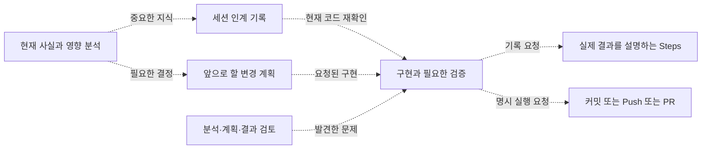

# v3 Skill 구현 결과

대상: 2026-09-27에 구현한 v3의 첫 버전. 소스는 이후 `e8e9328`에 커밋했다. 이 문서는 그 구현 결과를 설명하며, 후속 검토에서 독자가 이해하기 쉽도록 설명을 보완했다. 최초 구현·검증 사실과 후속 결과는 구분한다. 후속 변경은 [재검토와 전후 비교](2026-09-27-v3-skill-review.md)를 본다.

## 배경과 변경 전 문제

사용자의 개발 과정은 코드 조사와 분석, 구현 계획 검토, 새 세션에서의 구현, 결과 기록, 커밋과 PR로 이어진다. 긴 작업에서는 세션이 바뀔 때 중요한 판단이 사라질 수 있고, 요청한 수정이 저장·백그라운드 처리·화면 표시로 이어지는 영향을 놓칠 수 있다. 그래서 v3는 각 단계의 책임과 인계할 근거를 명확히 하는 것을 목표로 했다.

기존 main의 5개 Skill도 계획 없는 명확한 수정과 실제 변경 내역 중심의 검증을 지원했다. 다만 분석 중 지식을 넘기는 기록, 어디까지 영향을 조사할지 정하는 기준, 실제 실행과 오래된 테스트가 충돌할 때의 판단, 커밋·PR 실행의 책임은 충분히 구체적이지 않았다. v2의 Plugin 실험은 문제가 보고됐지만 원인은 확정하지 못했다. 따라서 v2의 복잡한 단계 상태 관리나 계획 해시를 통한 승인 절차를 복원하지 않고, 독립적으로 사용할 수 있는 역할을 정리했다.

여기서 Context는 **다음 세션이 잃지 않아야 할 요구·사실·결정의 인계 기록**, Plan은 **앞으로 할 일**, Steps는 **실제로 바뀐 결과**를 뜻한다. 자세한 원문 대조는 [설계 문서](../04-v3-upgrade-considerations.md)에 있다.

## 실제 구성과 흐름

| main 역할 | v3 결과 | 주요 변화 |
|---|---|---|
| 없음 | `analyzing-work` 신설 | 현재 구조·원인과 입력부터 저장·표시까지 영향을 조사하고 필요한 지식을 인계 |
| `task-planning` | 개편 | 확인된 사실로부터 앞으로 바꿀 위치·동작·검증 방법을 결정 |
| 없음 | `reviewing-development-work` 신설 | 요청된 분석·계획·구현의 누락과 위험을 검토 |
| `implementation-workflow` | 개편 | 관련 영향을 조사한 뒤 필요한 범위를 수정하고 실제 결과를 확인 |
| `steps-documentation` | 개편 | 실제 배경·이유·전후 흐름·검증·제한 설명 |
| `preparing-commit` | `commit-workflow`로 이동·개편 | 메시지/단위 준비와 명시된 Commit·Push 실행 구분 |
| `pr-documentation` | `pr-workflow`로 이동·개편 | 전체 PR diff 기반 설명과 명시된 생성·갱신 실행 구분 |

각 역할은 요청된 작업에 맞춰 선택한다. 아래 점선은 가능한 인계이며 모든 단계가 의무인 실행 순서는 아니다.

작은 수정은 바로 구현과 확인으로 끝날 수 있다. 긴 작업은 중요한 사실과 결정을 Context에 남기고, 새 세션은 그것을 읽은 뒤 현재 코드를 다시 확인한다. 별도 검토는 요청이나 구체적 위험이 있을 때 선택한다. 그림은 역할 관계 설명이며 Mermaid 렌더링은 확인하지 않았다.

## 실제 개발에서 달라지는 판단

| 상황 | v3가 요구하는 판단 | 이 기준이 필요한 이유 |
|---|---|---|
| API가 만드는 상태 값을 변경 | 값을 저장·처리·표시하는 쪽의 의미와 오류 경로까지 확인 | 직접 수정한 파일만 맞고 화면은 이전 상태로 남는 누락을 줄이기 위해 |
| 외부 응답과 테스트 입력이 다름 | 실제 응답의 조건·버전과 합의된 계약을 확인한 뒤 어느 쪽이 낡았는지 판별 | 잘못된 테스트 입력에 맞춰 구현을 바꾸지 않기 위해 |
| 테스트를 추가하려 함 | 기존 검사에서 놓치는 중요한 실패가 있는지 확인 | 같은 조건만 여러 층에서 반복 검사하지 않기 위해 |
| 커밋 등 다음 단계로 이동 | 관련 코드·환경·위험이 같은지 보고 이전 검증 결과를 재사용 | 단계가 바뀌었다는 이유만으로 같은 검사를 반복하지 않기 위해 |

이 표는 Skill에 작성한 판단 기준이다. 실제 개발 시스템에서 누락이나 실행 비용이 줄었다는 측정 결과는 아니다. 예를 들어 API에서 값을 만드는 쪽을 producer, 값을 사용하는 쪽을 consumer라고 부르지만, 중요한 것은 용어가 아니라 그 사이의 저장·전달·표시가 일치하는지 확인하는 것이다.

Git 두 Skill의 PREPARE는 **메시지·설명 준비**, EXECUTE는 **명시적으로 요청된 실행**이다. “커밋 메시지 보여줘”는 현재 변경을 읽고 제목·본문만 제공한다. “커밋해줘”는 확정된 변경의 커밋까지 수행하며 원격 전송이나 PR 생성으로 확대하지 않는다. PR 생성 요청도 아직 커밋하지 않은 변경을 자동으로 커밋할 권한은 아니다.

실행 응답이 유실되면 먼저 실제 커밋·원격 브랜치·PR 상태를 조회하도록 했다. 같은 요청을 그대로 반복해 중복 커밋이나 PR이 생기는 것을 피하기 위한 기준이다. GitHub/Gitea 같은 서비스의 실제 도구 기능은 실행 시 확인하도록 했으며, 이번 구현에서 실서비스 작업을 수행하지 않았다.

## 파일과 평가 명세

7개 `skills/*/SKILL.md`와 역할별 reference 5개를 작성했다. 옛 `preparing-commit`, `pr-documentation` 경로는 제거했다. 루트 README에 역할과 이름 대응을 추가했고, 과거 main 분석 문서의 원문 링크는 고정 SHA URL로 바꿔 현행 Skill과 구별했다. [B01~B07 평가 명세](../../tests/behavior/cases.md)는 작은 변경, lifecycle·인계·Steps, 외부 관측, Plan 검토, 검증 재사용, PREPARE, EXECUTE·응답 유실의 고유 실패를 다룬다. 기존 자동 테스트를 수정·삭제하지 않았고, Skill 파일별 문구 검사는 추가하지 않았다.

## 검증과 한계

`skill-creator`의 `quick_validate.py`는 현재 Python 환경에 `yaml` 모듈이 없어 시작되지 못했다. 별도 읽기 전용 검사로 Skill 7개 이름·frontmatter 필수 필드, role-local reference와 Markdown 상대 링크를 확인했다. `git diff --check`로 추적 파일의 공백 오류를 확인했다.

| 검사 | 결과 |
|---|---|
| `quick_validate.py` | 실패: 시작 시 `ModuleNotFoundError: yaml` |
| 자체 구조·링크 검사 | 통과: 7개 Skill frontmatter, 자체 reference, Markdown 상대 링크 52개 |
| `git diff --check` | 통과: 추적 파일의 공백 오류 없음 |
| B01~B07 실제 모델 행동 | 미실행. 격리된 GPT-5.6 Sol Medium 평가 환경이 현재 없음 |
| 실제 GitHub/Gitea Provider 통합 | 미실행. 이번 작업 범위에 실제 Push/PR 없음 |

위 검증 표는 **최초 구현 당시**의 결과다. 후속 검토의 공식 검증기 재실행과 현재 검증 내역은 [재검토 문서](2026-09-27-v3-skill-review.md)에 있다. 정적 검사는 파일 구조와 링크를 확인한 것이므로, Sol Medium이 자연어 요청에서 올바른 Skill을 선택하거나 원하는 문서를 작성한다는 증거는 아니다.
