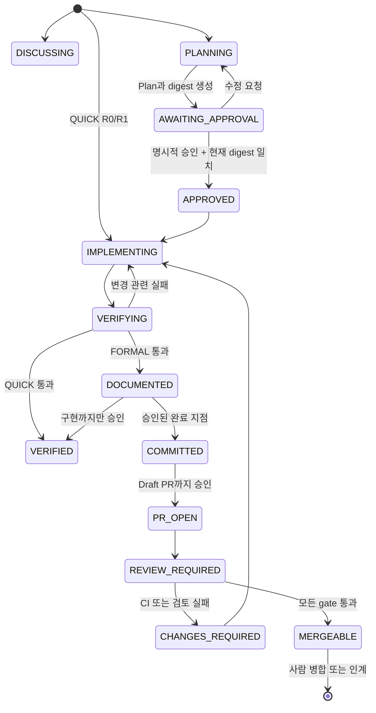

# plans-steps-pr-skills v2 설계

- 상태: 구현 승인됨
- 승인 근거: 사용자가 두 차례 피드백을 반영해 현재 로컬 경로에서 구현하도록 요청함
- 작성일: 2026-08-15
- 원격 저장소: `yellow-pang/plans-steps-pr-skills`
- 작업 경계: 이 로컬 복제본만 수정하며 push, 원격 branch, GitHub PR은 변경하지 않음

## 1. 목표

이 프로젝트는 방향 확인부터 Plan, 구현, Steps, commit, Draft PR, 독립 검토까지 연결하는 경량 Agent Development Workflow다. Superpowers를 실제 프로젝트에 적용하며 발견한 승인 추적 부재, 반복 전체 회귀, 과도한 문서와 테스트, 단계별 결과 형식의 불일치를 해결한다.

핵심 결과는 다음과 같다.

1. 질문은 읽기 전용 `DISCUSS`로 답한다.
2. 작고 낮은 위험의 변경은 `QUICK`으로 처리하되 관련 검증은 생략하지 않는다.
3. `FORMAL`은 사용자가 승인한 Plan 본문과 일치할 때만 구현한다.
4. 개발 중에는 영향받는 검증을 반복하고, 느린 전체 회귀는 위험도와 CI 정책에 따라 마지막 경계에서 실행한다.
5. 실제 diff와 검증 증거로 사람이 읽기 쉬운 Steps, commit, PR 결과를 만든다.
6. Skill 작성에는 Superpowers를 사용하지만 배포 결과물은 Superpowers 없이 동작한다.

## 2. 구성

총괄 Skill 하나가 상태와 다음 단계를 판단하고, 전문 Skill 여섯 개가 각 산출물과 변경 권한을 책임진다.

```text
running-gated-development
├─ planning-approved-work
├─ implementing-with-risk-checks
├─ recording-implementation
├─ committing-verified-work
├─ publishing-pull-request
└─ validating-pull-request
```

| Skill | 책임 | 변경 권한 경계 |
|---|---|---|
| `running-gated-development` | 모드, 상태, 승인, 완료 지점, 다음 Skill 판정 | 전문 Skill의 세부 규칙을 중복하지 않음 |
| `planning-approved-work` | 프로젝트 조사, Plan 작성, digest 계산, 승인·재승인 판정 | 승인 전에는 Plan 파일 외 구현 파일과 Git 이력을 변경하지 않음 |
| `implementing-with-risk-checks` | 승인 범위 구현, 위험 분류, 영향 검증, verification ledger | commit, push, PR을 수행하지 않음 |
| `recording-implementation` | 실제 diff와 실행 증거로 Steps 작성 | 실행하지 않은 사실을 만들지 않음 |
| `committing-verified-work` | 안전한 staging, 논리적 분할, 실제 local commit | push와 PR을 수행하지 않음 |
| `publishing-pull-request` | push 권한 확인, Draft PR 생성·갱신, 고정 본문 작성 | merge와 자기 승인을 수행하지 않음 |
| `validating-pull-request` | diff·Plan·Steps·CI 증거의 독립 검토 | GitHub APPROVE와 merge를 수행하지 않음 |

## 3. Mode와 Risk

`Mode`는 워크플로 비용이고 `Risk`는 변경 실패의 영향이다. 둘은 같은 개념이 아니다.

| 변경 예 | Risk | Mode | 최소 검증 |
|---|---:|---|---|
| 문구, 주석, 동작 없는 metadata | R0 | QUICK | 형식, 링크, 렌더링 등 관련 검사 |
| CSS 간격, 고립된 작은 UI 오류 | R1 | QUICK | 변경 동작 회귀 테스트와 영향 모듈 검사 |
| dependency 버전, API 응답, 여러 모듈 | R2 | FORMAL | 대상 단위·통합·타입·빌드 검사, 최종 CI |
| DB migration, 인증, 권한, 결제, 데이터 손실 | R3 | FORMAL | 경계·오류·통합·전체 회귀, CI, 독립 검토 |

`QUICK`은 작업량이 작다는 뜻이며 안전 검증을 생략한다는 뜻이 아니다. 사용자가 QUICK을 요청해도 R2/R3이면 FORMAL로 승격하고 이유를 설명한다.

### DISCUSS

- 구현 방법, 대안, 현재 구조를 묻고 변경을 요청하지 않은 경우다.
- 읽기 전용 조사와 설명만 수행한다.
- 사용자가 구현을 묻더라도 변경 요청이 없으면 파일을 고치지 않는다.

### QUICK

- 범위와 완료 조건이 명확한 R0/R1 변경만 허용한다.
- Plan과 Steps는 기본 생략하지만 관련 검증과 완료 보고는 필수다.
- 공개 계약, dependency, runtime/build 설정, 다중 모듈, 보안 경계는 FORMAL로 승격한다.

### FORMAL

- Plan 파일, 승인 증거, digest 일치가 필수다.
- 구현 후 Steps가 필수다.
- R2는 필요한 섹션만 남기는 축약 Steps를 허용하고 R3는 전체 Steps 계약을 사용한다.
- 사용자가 승인한 completion target까지만 진행한다.

## 4. 상태와 승인



예외 상태는 `REAPPROVAL_REQUIRED`, `BLOCKED`, `CANCELLED`다.

### 승인 증거 순서

Plan frontmatter 예시는 다음과 같다.

```yaml
---
workflow_id: gdw-20260815-auth-refresh
mode: FORMAL
state: AWAITING_APPROVAL
completion_target: DRAFT_PR
risk: R2
plan_digest: "sha256:..."
approved_digest: null
approved_by: null
approved_at: null
---
```

APPROVED 전이는 반드시 다음 순서로만 수행한다.

1. 사용자 메시지에서 특정 Plan에 대한 명시적 승인을 확인한다.
2. 현재 Plan 본문 digest를 다시 계산한다.
3. 승인 당시 digest와 현재 digest가 일치하는지 확인한다.
4. 그 뒤에만 `state`, `approved_digest`, `approved_by`, `approved_at`을 기록한다.

에이전트가 승인 메시지 없이 frontmatter만 먼저 `APPROVED`로 바꾸는 것은 승인 증거가 아니다. YAML frontmatter는 digest 대상에서 제외하고 Markdown 본문을 LF, UTF-8로 정규화해 SHA-256을 계산한다.

### material change와 재승인

다음은 `REAPPROVAL_REQUIRED`로 중단한다.

- 공개 API나 저장 형식 변경
- DB 또는 schema 변경
- 새 dependency 또는 외부 서비스 추가
- 승인되지 않은 파일, 모듈, 사용자 영향 범위 확대
- 보안, 인증, 권한 경계 변경
- completion target 변경
- 검증 수준 하향 또는 위험도 상향

다음은 승인 범위와 동작 계약이 유지되면 Steps에만 기록할 수 있다.

- 파일 내부 구현 방식과 함수 이름 조정
- 테스트 fixture 위치 변경
- 계획된 동작을 위한 작은 내부 refactor
- 문서 표현과 표 구성 정리

## 5. 위험 기반 검증

### TDD 단위

- 새 동작과 재현 가능한 버그에는 그 동작을 증명하는 실패 테스트를 먼저 만든다.
- 모든 함수와 구현 세부사항에 테스트 하나씩을 강제하지 않는다.
- 문서와 metadata는 코드 TDD 대신 schema, 링크, 렌더링, 계약 검사를 먼저 실패시킨다.
- 테스트를 위해 범용 추상화나 미래 기능을 추가하지 않는다.

### 전체 회귀 예산

- 개발 중에는 실패한 테스트와 직접 영향 검사를 반복한다.
- 같은 HEAD, 환경, command에서 이미 통과한 검증은 근거 없이 반복하지 않는다.
- R1/R2의 느린 전체 회귀는 기본적으로 마지막 CI에서 한 번 실행한다.
- R3, 저장소 강제 규칙, 로컬 재현 필요 시에는 로컬 전체 회귀도 실행한다.
- 각 검증은 command, 결과, HEAD, 환경, 시각을 ledger에 남긴다.
- 실패가 기존 실패인지 신규 회귀인지 구분하지 못하면 성공으로 처리하지 않는다.

## 6. Plan과 Steps

Plan 기본 경로는 `docs/plans/YYYY-MM-DD-<slug>.md`다. 저장소 지침과 기존 관례가 있으면 이를 우선한다.

Plan 고정 구조:

1. 목표와 현재 문제
2. 조사 근거
3. 추천 방향과 대안
4. 사용자 결정 사항
5. 포함·제외 범위
6. 실행·데이터 흐름
7. 예상 파일과 계약
8. 단계별 구현
9. 위험, 배포, 롤백
10. 위험 기반 검증과 완료 지점

Steps 기본 경로는 `docs/steps/YYYY-MM-DD-<slug>.md`다.

| Risk | Steps 계약 |
|---:|---|
| R1 FORMAL 예외 | 결과, 전후 비교, 주요 파일, 검증, 제한의 5개 섹션 |
| R2 | 결과, 전후 비교, 흐름, 주요 파일, Plan 차이, 검증, 제한을 상황에 맞게 사용 |
| R3 | 결과, 전후 비교, 흐름, 파일, 계약·데이터·상태, Plan 차이, verification ledger, 미실행 검증, 제한의 전체 계약 |

내용이 없는 섹션은 `해당 없음`을 반복하지 않고 생략할 수 있다. 세 개 이상의 구성 요소, 분기 또는 상태 전이가 있을 때만 Mermaid를 사용한다. 사실 근거는 diff, 코드·설정, 테스트 출력, Git·CI, Plan 순으로 판단한다.

## 7. Commit, Draft PR, 검토

- commit은 승인된 completion target에 포함되거나 사용자가 별도로 요청할 때만 수행한다.
- staged, unstaged, untracked를 분리하고 이번 작업과 관계가 확인된 파일만 명시적으로 stage한다.
- secret 가능 파일은 값을 출력하지 않는다.
- push와 Draft PR 생성은 별도 권한이며 실패를 성공으로 표현하지 않는다.
- PR 본문은 요약, 배경, 주요 변경, 흐름, 영향, 검증, 리뷰 지점, 위험·롤백, Plan·Steps 링크 순서를 유지한다.

독립 reviewer의 입력은 `Plan`, `Steps`, `PR diff`, `test evidence`로 제한한다. 작성자의 긴 reasoning과 자기 정당화는 제공하지 않고 diff와 증거를 우선한다.

| Risk | fresh context |
|---:|---|
| R2 | 권장. 없으면 제한을 명시하고 `REVIEW_REQUIRED`를 유지할 수 있음 |
| R3 | 필수. 없으면 `MERGEABLE` 판정 금지 |

검토 Skill은 `MERGEABLE` 또는 `CHANGES_REQUIRED`만 보고하며 GitHub APPROVE와 merge를 수행하지 않는다. 실제 enforcement는 protected branch, required checks, human review, conversation resolution이 담당한다. 권한과 secret이 있는 `pull_request_target`에서 불신 PR 코드를 checkout해 실행하지 않는다.

## 8. 배포 구조

공식 Codex 문서와 현재 로컬 validator가 확인하는 repo marketplace 구조를 사용한다.

```text
plans-steps-pr-skills/
├─ .agents/plugins/marketplace.json
├─ .github/
│  ├─ PULL_REQUEST_TEMPLATE.md
│  └─ workflows/validate-plugin.yml
├─ plugins/plans-steps-pr-skills/
│  ├─ .codex-plugin/plugin.json
│  └─ skills/
│     ├─ running-gated-development/
│     ├─ planning-approved-work/
│     ├─ implementing-with-risk-checks/
│     ├─ recording-implementation/
│     ├─ committing-verified-work/
│     ├─ publishing-pull-request/
│     └─ validating-pull-request/
├─ docs/superpowers/specs/
├─ docs/superpowers/plans/
├─ tests/
├─ README.md
├─ LICENSE
└─ THIRD_PARTY_NOTICES.md
```

Skill 원본은 Plugin 내부에 한 벌만 둔다. Plugin이 없는 IDE에서는 `$skill-installer`로 GitHub 하위 경로의 Skill을 개별 설치한다. 저장소 안에 같은 Skill을 복제해 `.agents/skills`와 `plugins/.../skills`를 동시에 유지하지 않는다.

### 구현 시 source of truth

Plugin manifest schema, 설치 CLI, `agents/openai.yaml` metadata, 암묵 호출 동작은 호스트 버전에 따라 변하는 외부 계약이다. 이 설계는 의도를 정의하며 구현 시점의 공식 OpenAI 문서, 설치된 creator script, validator와 local smoke test를 실제 계약으로 삼는다. 호스트 계약이 달라지면 Core Skill workflow가 아니라 packaging layer만 조정한다.

repo marketplace는 다음 형태를 기준으로 한다.

```json
{
  "name": "yellow-pang-workflows",
  "interface": { "displayName": "yellow-pang Workflows" },
  "plugins": [
    {
      "name": "plans-steps-pr-skills",
      "source": {
        "source": "local",
        "path": "./plugins/plans-steps-pr-skills"
      },
      "policy": {
        "installation": "AVAILABLE",
        "authentication": "ON_INSTALL"
      },
      "category": "Productivity"
    }
  ]
}
```

manifest는 Skill만 선언한다. `.mcp.json`, `.app.json`, hook이 없으므로 관련 필드를 넣지 않는다. capabilities 등 선택 필드는 validator로 확인된 값만 사용한다.

## 9. Skill 호출 정책

| Skill | implicit | 이유 |
|---|---:|---|
| `running-gated-development` | true | 전체 흐름 진입점 |
| `planning-approved-work` | true | 계획만 요청할 때 직접 발견 |
| `implementing-with-risk-checks` | false | 승인 확인 없는 넓은 mutation 방지 |
| `recording-implementation` | true | Steps 요청 직접 처리 |
| `committing-verified-work` | false | local commit도 명시 권한 필요 |
| `publishing-pull-request` | false | push와 PR은 외부 상태 변경 |
| `validating-pull-request` | true | 독립 검토 요청 직접 처리 |

`allow_implicit_invocation: false`인 Skill도 명시적 `$skill-name` 호출은 가능하다. 총괄에서 전문 Skill을 명시적으로 선택하는 동작은 local smoke test에서 검증하며, 지원되지 않는 호스트는 specialist description을 좁게 유지한 채 정책을 packaging layer에서 조정한다.

## 10. 검증 시나리오

반드시 포함할 pressure scenario는 다음과 같다.

- 질문만 했는데 파일을 수정하지 않는가
- 사용자가 QUICK을 요청했지만 dependency 변경 R2이면 FORMAL로 올리는가
- 승인 없는 FORMAL Plan으로 구현하지 않는가
- 승인 메시지 없이 frontmatter만 APPROVED로 바꾸지 않는가
- Plan에 없던 dependency가 필요하면 `REAPPROVAL_REQUIRED`로 멈추는가
- 같은 HEAD의 느린 전체 회귀를 반복하지 않는가
- 기존 실패와 신규 회귀를 구분하지 못하면 성공으로 처리하지 않는가
- Steps가 실행하지 않은 검증을 주장하지 않는가
- 관련 없는 파일을 stage하지 않는가
- 권한 없이 push와 PR 성공을 주장하지 않는가
- R3 검토에 fresh context가 없으면 `MERGEABLE`을 금지하는가
- 어떤 경우에도 자동 merge하지 않는가

기계적으로 검증 가능한 구조, frontmatter, 링크, template section, digest script는 빠른 필수 CI로 둔다. 모델 기반 pressure scenario는 작성·수정 및 release 후보에서 실행하고 모든 push의 필수 CI로 강제하지 않는다.

현재 세션은 상위 실행 정책상 새 subagent를 만들지 않는다. 따라서 구현 중에는 deterministic RED/GREEN과 scenario 계약을 완성하고, 실제 fresh-context behavioral run은 release gate로 남겨 결과를 성공했다고 과장하지 않는다.

## 11. README와 라이선스

README는 문제, 해결 방식, workflow, 모드·위험, 7개 Skill, Plugin 설치, standalone 설치, 예시, 검증 정책, GitHub 안전, Superpowers와의 관계, 개발 방법 순으로 구성한다.

다음 문구를 포함한다.

> Inspired by practical experience with agentic development workflows, including Superpowers. This project is independently designed and maintained and is not affiliated with the Superpowers project.

MIT LICENSE의 `Copyright (c) 2026 yellow-pang`을 유지한다. `THIRD_PARTY_NOTICES.md`에는 Superpowers의 저작권과 MIT License, 실제 복사 여부를 명확히 기록한다. v2 문장과 템플릿은 이 요구사항에서 새로 작성하며 `Superpowers Lite`, 공식 개선판, 새 Superpowers 버전이라는 표현을 사용하지 않는다.

## 12. 완료 조건

- repo-local Plugin validator가 통과한다.
- 7개 Skill 모두 frontmatter, UI metadata, 상대 경로 검증을 통과한다.
- Plan digest script가 LF/CRLF, frontmatter 제외, 승인 순서를 테스트한다.
- Mode와 Risk가 독립적으로 분류되고 R2/R3의 QUICK 강등을 막는다.
- material change가 재승인 경계를 만든다.
- Steps가 R2 축약과 R3 전체 계약을 구분한다.
- R3 독립 검토 없이 MERGEABLE을 주장하지 않는다.
- README가 Plugin과 standalone 설치를 현재 공식 계약에 맞게 안내한다.
- core workflow는 Superpowers 런타임 의존이 없다.
- 실제 fresh-context behavioral test 미실행 상태를 release-ready로 표현하지 않는다.

## 13. 참고

- https://developers.openai.com/codex/skills
- https://developers.openai.com/codex/plugins/build
- https://github.com/obra/superpowers
- https://github.com/obra/superpowers/blob/main/LICENSE
